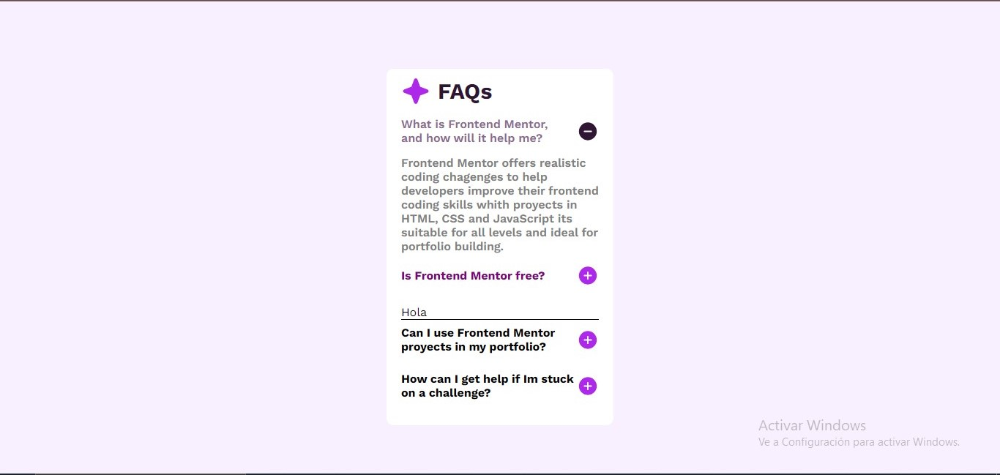

# Preguntas frecuentes ❔

**En este desafío consistio en, construir un acordeón de preguntas frecuentes. Este es un patrón de interfaz de usuario extremadamente común, por lo que es una excelente oportunidad para practicar HTML CSS y un poco de JavaScript.**

**Los usuarios deberan ver:**
- Ocultar/Mostrar la respuesta a una pregunta cuando se hace clic en la pregunta
- Navegue por las preguntas y oculte/muestre respuestas utilizando únicamente la navegación con el teclado
- Ver el diseño óptimo para la interfaz según el tamaño de pantalla de su dispositivo

## Link
**https://leonardo291024.github.io/acordeon-preguntas/**

